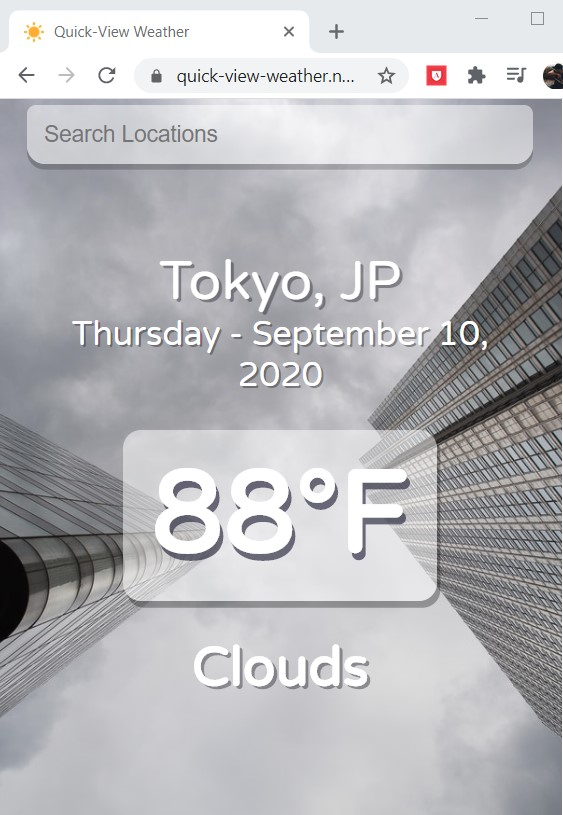

# Quick-View Weather

Using Tyler Potts' (https://lnkd.in/gxB8vnK) React weather app guide as the base for this fun little weather app. Tweaked the if/else statement to show a different image for each type of weather based on the city entered. Axios GET requests used to pull data in from the http://openweathermap.org api!

## Deployment

Using Netlify, this project is deployed at https://quick-view-weather.netlify.app/. Built and deployed as a mobile-first app, it also works well on desktop.

## Built With

* [React](https://reactjs.org/) - The web framework used
* [CSS](https://www.w3schools.com/css/) - Styling designed with CSS
* [Axios](https://github.com/axios/axios) - GET Requests performed usin Axios
